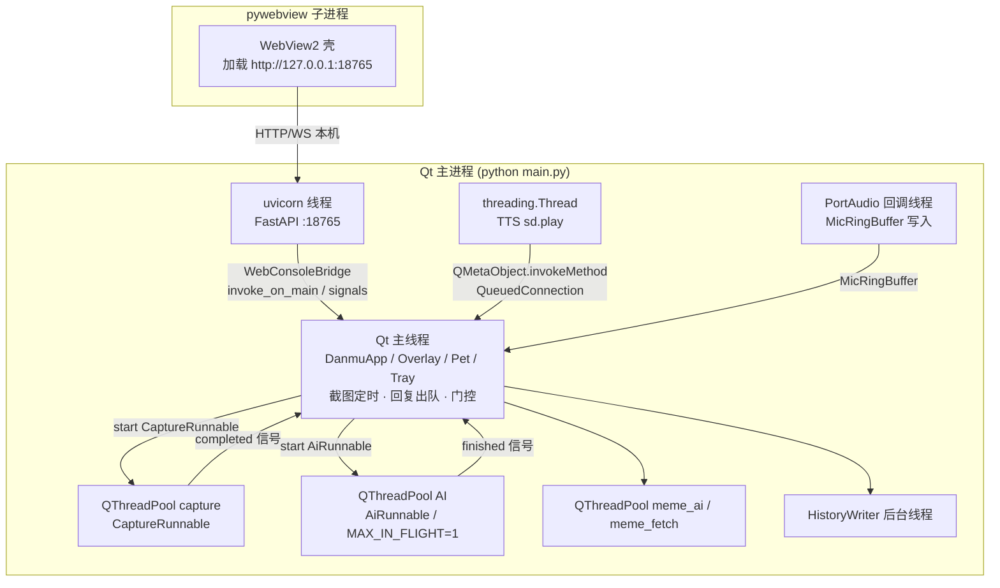
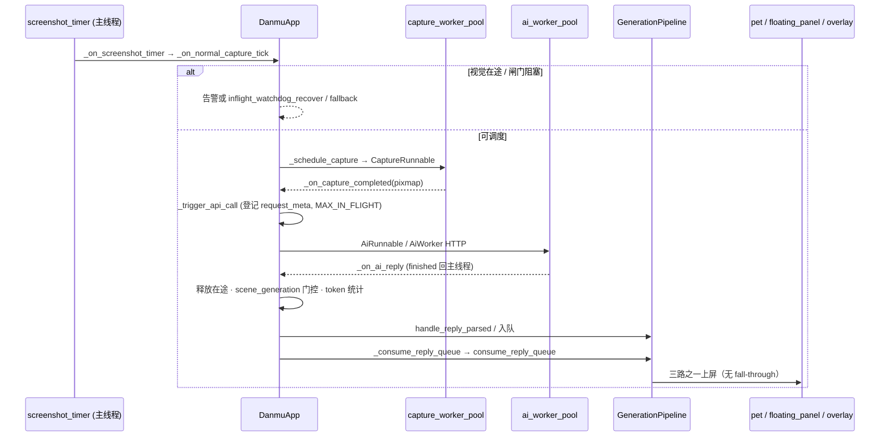
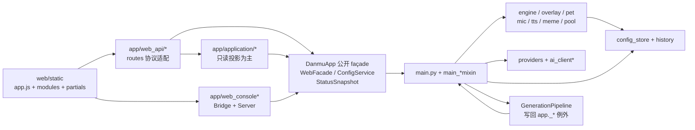

# DanmuAI 架构分析报告（2026-07-10）

> **文档同步说明（2026-07-12）**：本文记录的 `AGENTS.md`“仍写 8 个 Mixin”在分析时成立，现已修正为 13 个。该项保留为历史发现，不再是开放缺陷；当前继承顺序见 [DanmuApp 13 Mixin 能力矩阵](danmu-app-mixin-capability-matrix.md)。
>
> **分析日期**：2026-07-10  
> **仓库路径**：`E:\test\danmu`  
> **HEAD（已确认）**：`52f1c8a`（完整 `52f1c8ae626f0ea75af39c60b8225b94708bc074`）  
> **分析方式**：只读源码核查（未修改任何业务代码；不覆盖 `architecture-report.md` / `01-06` 系列）  
> **证据约定**：关键断言标注 **已确认**（附 `文件:行号` 或可复现命令）或 **推断**（说明如何确认）  
> **范围**：架构图、模块连接、四类问题识别；**不提供修复方案、不落地工单**

---

## 0. 与既有文档的关系

| 文档 | 关系 |
|------|------|
| `docs/architecture-report.md`（2026-07-08） | 结构相近但已漂移：仍写 **8 Mixin / DisplayMixin**；本报告以当前源码为准 |
| `docs/01-架构总结.md` … `06-探索事实附录.md` | 系列架构综述；不覆盖，本文件为日期化快照 |
| `docs/main-pipeline-sequence.md` / `runtime-state-map.md` / `final-architecture-baseline.md` | boundary_guard 维护者登记表；连接关系与其一致处引用，冲突以 `main.py` + `app/` 为准 |
| `docs/cpu-performance-audit-report.md` / `dead-code-audit-report-2026-06-22.md` | 历史审计；本报告仅保留经 2026-07-10 复核仍成立的项，并点名失效项 |
| `AGENTS.md` 附录 A | 分析时仍写「共 8 个 mixin」（`AGENTS.md:335`、`:363`）；**2026-07-12 已修正为 13 个**，本行保留历史发现 |

**关键漂移（相对 07-08 报告，已确认）：**

1. `DanmuApp` 从 **8 Mixin** 演进为 **13 Mixin + QObject**（`main.py:99-114`）。
2. `app/main_display_mixin.py` **不存在**（`Test-Path` → `False`）；显示职责已拆到 `RenderCoordinator` / `Pet` / `Overlay` / `FloatingPanel` / `BililiveDm` / `ScreenTopology`。
3. 脱敏逻辑已统一到 `app/logger.py:sanitize_sensitive_text`；TTS HTTP 错误已复用 `ai_client_support.extract_http_error_message`（旧「重复脱敏 / TTS 错误解析」结论过时）。
4. 桌宠渲染循环已有 `needs_animation_tick` / `stop_render_loop` / 唤醒定时器自适应（`pet_window.py:510-551`），旧「60fps 永不停止」表述需改写。

---

## 1. 架构概览

### 1.1 一句话定位

DanmuAI 是 **Windows 本机桌面应用**：Qt 主进程持有截图→视觉 AI→弹幕上屏主链路与 Overlay/托盘；FastAPI（uvicorn 线程）+ 可选 pywebview **子进程**提供 Web 控制台；无遗留 Qt 主窗（废弃入口 `sys.exit(2)`）。

### 1.2 入口与装配（已确认）

`python main.py` → `main()`（`main.py:864+`）大致顺序：

1. `multiprocessing.freeze_support()` + `mark_app_start()` / `log_startup`
2. `check_deprecated_launch_args()`（`app/main_launch.py`）拒绝 `--qt-ui` / `--legacy-ui` / 相关环境变量
3. `run_startup_apply_if_needed()`（Velopack 启动应用更新）
4. `QApplication` + `setQuitOnLastWindowClosed(False)` —— **无 Qt 主窗**
5. `SingleInstanceGuard.try_acquire()`；激活已有实例则退出；激活失败重试 3 次
6. `DanmuApp(web_launch_mode=...)` → `app.exec()`

#### DanmuApp：13 Mixin + QObject

```python
# main.py:99-114（已确认）
class DanmuApp(
    DanmuAppLaunchMixin,              # 启动编排
    DanmuAppWebFacadeMixin,           # 对外 Web façade
    DanmuAppStateMixin,               # 状态访问器
    DanmuAppMicMixin,                 # 麦克风双轨
    DanmuAppRenderCoordinatorMixin,   # 显示/上屏协调
    DanmuAppPetMixin,                 # 桌宠
    DanmuAppOverlayMixin,             # 全屏 Overlay
    DanmuAppFloatingPanelMixin,       # 浮动面板
    DanmuAppBililiveDmMixin,          # bililive_dm 推送
    DanmuAppScreenTopologyMixin,      # 屏幕拓扑/置顶健康
    DanmuAppRequestContextMixin,      # request meta / scene_generation
    DanmuAppMemeMixin,                # 烂梗弹幕
    DanmuAppLifecycleMixin,           # 生命周期 start/stop/quit
    QObject,
):
```

`DanmuApp.__init__` 六段初始化（`main.py:136-155`，实现多在 `main_lifecycle_mixin`）：

| 顺序 | 方法 | 职责锚点 |
|------|------|----------|
| 1 | `_init_runtime_bridge_state` | `main_lifecycle_mixin.py:48` web_bridge/web_server 占位 |
| 2 | `_init_core_subsystems` | `:59` Config / Persona / Engine / Overlay / Tray / Hotkey / FloatingPanel 等 |
| 3 | `_init_request_pipeline_state` | `:117` reply_buffer/timer、CaptureCoordinator；`:175-177` **`GenerationPipeline(self)`** |
| 4 | `_init_runtime_tracking_state` | `:179` screenshot_id / scene_generation / inflight |
| 5 | `_init_startup_services` | `:271` tray 等 |
| 6 | `_start_web_console_stack` | `:316-320` `attach_web_console(self)` + pywebview 相关 |

另：`build_status_snapshot` → `StatusSnapshotBuilder`；`apply_web_config_payload` → `ConfigService`（`main.py` 类体公开 façade）。

### 1.3 分层职责

| 层 | 主要路径 | 职责 |
|----|----------|------|
| 入口 / 宿主 | `main.py` + `app/main_*mixin.py` | 单例状态机、主链路闸门、Mixin 组合 |
| 应用边界 | `app/application/*` | 配置写入、状态投影、诊断、**GenerationPipeline 回复消费**（写回例外） |
| 领域显示 | `danmu_engine/`、`overlay.py`、`floating_panel_*`、`pet/` | 轨道、渲染、桌宠窗口 |
| 采集与 AI | `runnable.py`、`worker_pools.py`、`ai_client*.py`、`providers/` | 截图池、AI 池、协议适配 |
| 旁路输入 | `mic_*.py`、`meme_barrage/`、bililive bridge/push | 麦、烂梗、插件弹幕 |
| TTS / 读弹幕 | `danmu_tts*.py`、`tts_*`、`danmu_read_service.py` | 合成与互斥播放 |
| Web | `web_console*.py`、`web_api/`、`web/static/` | HTTP/WS、路由、控制台 UI |
| 持久化 | `config_store/`、`history_writer.py` | SQLite/KV、加密、历史 |

**规模抽样（已确认，PowerShell 行数，2026-07-10）：** `app/**/*.py` 约 **183** 文件；`tests/test_*.py` 约 **210** 文件。

### 1.4 主链路方法锚点（已确认）

| 阶段 | 符号 | 位置 |
|------|------|------|
| 定时器 | `_on_screenshot_timer` | `main.py:366` |
| 闸门 | `_on_normal_capture_tick` | `main.py:370` |
| 截图调度 | `_schedule_capture` | `main.py:322` |
| 截图完成 | `_on_capture_completed` | `main.py:347` |
| API 触发 | `_trigger_api_call` | `main.py:554` |
| AI 回复 | `_on_ai_reply` | `main.py:810` |
| 队列消费 façade | `_consume_reply_queue` | `main.py:855` → `GenerationPipeline.consume_reply_queue` |

主链路 docstring 声明（`main.py:8-10`）：

```text
screenshot_timer → _on_normal_capture_tick → _schedule_capture → CaptureRunnable
→ _on_capture_completed → _trigger_api_call → AiRunnable → _on_ai_reply → ...
```

关键常量（`app/main_helpers.py:18-27`）：

- `VISUAL_INFLIGHT_WARN_SEC = 45.0`
- `VISUAL_INFLIGHT_RECOVER_SEC = 48.0`
- `REQUEST_WALL_CLOCK_SEC = 45.0`
- `MAX_IN_FLIGHT = 1` / `MAX_MIC_IN_FLIGHT = 1`

### 1.5 渲染三路分发（已确认）

`GenerationPipeline.consume_reply_queue`（`app/application/generation_pipeline.py:40-53`）**无 fall-through**：

1. `_pet_barrage_mode_enabled()` → `_dispatch_to_pet`
2. `_danmu_render_mode() == "floating_panel"` → `_dispatch_to_floating_panel`
3. 否则 → `_dispatch_to_overlay`

`reply_timer` / `reply_buffer` 所有权仍属 `DanmuApp`；管线通过 `self._app` 驱动 `reply_timer.start()`（文件头注释 `generation_pipeline.py:1-10`）。

---

## 2. 架构图

### 2.1 进程 / 线程部署



### 2.2 主链路时序（普通视觉模式）



### 2.3 依赖方向（逻辑分层）



**边界约束（已确认，文档 + 源码一致）：**

- HTTP 线程 **禁止** 直接改 Qt / `config` 触发 engine；须 `WebConsoleBridge` 信号或 `invoke_on_main`（`web_console.py` 模块 docstring；`INVOKE_ON_MAIN_TIMEOUT_SEC = 10.0` 于 `web_console.py:89`）。
- `application/` 一般禁止 `getattr` 读 `DanmuApp` 下划线私有字段（`app/application/__init__.py`）；**例外**：`generation_pipeline.py` 经 boundary_guard 允许写回主链路字段。
- `web_api` 应使用公开 façade（`web_api/routes.py` 文件头）。

---

## 3. 模块如何连接

### 3.1 核心子系统连接表

| 子系统 | 持有 / 入口 | 如何连到 DanmuApp |
|--------|-------------|-------------------|
| ConfigStore | `_init_core_subsystems` | 配置读写；legacy 迁移在 `storage.py` 启动路径 |
| DanmuEngine + Overlay | 同上 + `OverlayMixin` | `engine.add_text` / 渲染循环；全屏弹幕 |
| FloatingPanel | `FloatingPanelMixin` + engine/overlay 文件 | render mode = floating_panel 时由 GP 分发 |
| Pet | `PetMixin` + `app/pet/*` | pet barrage 模式时 GP → pet；独立动画循环 |
| GenerationPipeline | `_init_request_pipeline_state:177` | `_on_ai_reply` 后置 + `_consume_reply_queue` 委托 |
| Capture / AI 池 | `runnable.py` + `worker_pools.py` | `CaptureRunnable` / `AiRunnable`；`MAX_IN_FLIGHT=1` |
| Web 控制台 | `attach_web_console` | uvicorn 线程 + Bridge；`register_web_routes` |
| Mic | `MicMixin` + `mic_*.py` | PortAudio → ring buffer → 主线程 poll；可走 AI 池 |
| Meme | `MemeMixin` + `meme_barrage/` | 独立服务与池；`danmu_pool_overlay.is_overlay_safe` 过滤 |
| Bililive | `BililiveDmMixin` + `application/bililive_*` + `web_api/bililive_dm_bridge` | bridge 鉴权 + push service（contracts 已在 application 侧） |
| TTS / 读弹幕 | `danmu_tts_playback` 等 | worker 线程播放；`QueuedConnection` 回主线程 |
| Providers | `app/providers/*` + `model_providers.py` / `model_catalog.py` | 能力注册、endpoint 猜测、请求体差异 |
| 状态投影 | `StatusSnapshotBuilder` / diagnostics | Web `/api/status`、`/api/diagnostics`（SSE 间隔等在 routes） |

### 3.2 Web 控制台连接

- 注册：`register_web_routes(app, bridge, check_token)`（`web_api/routes.py:58`）聚合 persona、pool、pet、meme、update、ai_butler、bililive 等子模块。
- 写路径：Bearer + `bridge.invoke_on_main` 或 `save_config_via_bridge`（routes / web_console 文件头说明）；超时 `MainThreadInvokeTimeout`。
- 静态资源：`web/static/`（`index.html` 由 partials 构建；`app.js` + `modules/*`）。
- 桌面壳：`app/webview_shell.py` **子进程** 打开本机 URL，与 Qt 主线程隔离。

### 3.3 代际与过期

- **`screenshot_id`**：有效截图递增；用于 supersede / 批次关联（`main.py` 模块 docstring）。
- **`scene_generation`**：场景配置指纹版本（topic/nickname/screen/region 等变更递增；start/stop 重置；截图不推进）。
- 过期判定：`DanmuAppRequestContextMixin` 中 `_visual_reply_stale_reason`（含 `scene_generation_lagged`）——新功能不得擅自关闭（AGENTS 约束，源码在 request_context mixin）。

### 3.4 旁路摘要

| 旁路 | 连接要点 |
|------|----------|
| 麦克风 | 与视觉共享 AI 池约束（`MAX_MIC_IN_FLIGHT`）；utterance 状态机在 `mic_utterance` |
| 弹幕池 top-up | `main.py` `_maybe_pool_topup` → `danmu_pool.plan_pool_topup` |
| 本地 fallback | `live_freshness.build_local_fallback_batch` / 慢模型判定 |
| 更新 | Velopack / `update_service` / Supabase app updates（启动与控制台触发） |
| 单实例 | `SingleInstanceGuard` 激活已有进程 |

---

## 4. 问题清单（只识别，不修）

### 4.1 重复逻辑

| # | 问题 | 证据 | 状态 |
|---|------|------|------|
| R1 | **豆包 / OpenAI 请求双轨平行实现** | `ai_client_requests.py:74` `request_doubao`、`:220` `request_openai`；stream 分别为 `:185`、`:342`。对称重试 / wall_clock / 交付模式，请求体构造不同 | **已确认** 结构重复；维护需双处同步 |
| R2 | **流式解析拆分标准不一致** | doubao stream 外提 `doubao_responses_stream.py`；openai stream 逻辑留在 `ai_client_requests` | **已确认** 组织不一致（非行为 bug） |
| R3 | **图像压缩双后端** | `image_compress.py`（PIL，HTTP 预览）vs `screenshot_compress.py`（QPixmap，主链路）；共用 `jpeg_resize.jpeg_bytes_to_data_uri` | **已确认**；文件头明确线程/依赖原因，属有意双实现，仍是契约重复面 |
| R4 | **兼容 re-export / 薄包装** | `danmu_tts.py`（DEPRECATED 指向 `tts_providers`）；`personae.py` 重导出 `append_*`；`web_console.py` 聚合 re-export | **已确认** 导入路径模糊，非算法重复 |
| R5 | **13 Mixin 显示相关分裂后的协调成本** | 原 DisplayMixin 已删除；现 `RenderCoordinator` / `Pet` / `Overlay` / `FloatingPanel` / `Bililive` / `ScreenTopology` 多文件协作 | **已确认** 重复感来自分发与可见性逻辑跨 mixin，而非单文件职责混杂 |
| R6 | ~~脱敏正则跨模块重复~~ | `ai_client_support.sanitize_provider_error_snippet` → `logger.sanitize_sensitive_text`；`web_console_support.summarize_config_save_error` 同样调用 `sanitize_sensitive_text` | **旧报告过时（已收敛）** |
| R7 | ~~TTS / AI HTTP 错误解析双份~~ | `tts_providers.py` `from app.ai_client_support import extract_http_error_message` | **旧报告过时（已收敛）** |

### 4.2 死代码与遗留负担

> 区分：**真死代码**（无引用） vs **兼容垫片 / 拒绝守卫 / 数据迁移**（有意保留）。

| # | 项 | 证据 | 判定 |
|---|----|------|------|
| D1 | 废弃启动参数守卫 | `main_launch.check_deprecated_launch_args`；`main.py:main` 调用 | **遗留兼容，非死代码** |
| D2 | legacy 配置迁移群 | `config_store/storage.py:112-166`、`:1066+`；`config_defaults.migrate_legacy_*` | **遗留迁移负担**；启动仍执行 |
| D3 | TTS / persona DEPRECATED API | `danmu_tts.synthesize_mimo_tts`；`personae` 注释要求改从 `persona_contract` 导入 | **兼容垫片** |
| D4 | `persona_version_history.list_versions` | 整文件 9 行，单行委托 `templates.versions`；**仍被** `web_api/persona.py:91` 导入 | **过度碎片化，非死代码** |
| D5 | `scene_brief` / 实时弹幕模式等 | AGENTS 声明已删除；本分析未在主链路看到恢复 | **已移除能力**；文档/归档中出现应视为历史 |
| D6 | **勿标死（仍在使用）** | `runnable`+`worker_pools`；`danmu_pool_overlay`（meme + web_api pool）；`live_overlay_hub`（web_console）；`danmu_engine_models`（engine + GP + render coordinator） | **已确认在用** |

**推断 / 待人工确认：** 未跑 vulture/覆盖率全量；未声明「仓库零死代码」。微观未使用导入、仅测试引用的符号需专用扫描，**不在本报告断言为已清除**。

### 4.3 性能瓶颈

| # | 问题 | 证据 | 说明 |
|---|------|------|------|
| P1 | **视觉并发硬限制 MAX_IN_FLIGHT=1** | `main_helpers.py:26`；主链路闸门 | **吞吐上限 / 正确性优先**，非实现失误；慢模型下截图节奏受制 |
| P2 | **主线程承担回复解析、去重、三路分发** | `_on_ai_reply` + `GenerationPipeline` 均在 Qt 主线程（GP 文件头） | 高密度弹幕时与 Overlay 渲染争用 |
| P3 | **去重纯 Python Levenshtein 回退 O(m×n)** | `danmu_engine_dedup.py`：`_FALLBACK_MAX_LEN=32`、优先 C 扩展、`deque` 窗口、threshold 默认 0.5 | **已知风险点**；有缓解。无 C 扩展时主线程成本上升 |
| P4 | **invoke_on_main 同步阻塞 HTTP worker** | `web_console.py:184+`，默认 10s 超时 | 主线程忙时写 API 延迟/504；有超时计数可观测 |
| P5 | **渲染定时器** | Overlay：`start/stop_render_loop` + `needs_render_tick`；Pet：`_ANIM_INTERVAL_MS=16` 且 `_sync_render_timer` 可在无动画需求时 `stop_render_loop`（`pet_window.py:510-551`） | **已确认** Pet 具备空转收敛；持续高频仅在 `needs_high_frequency_tick` 时。相对旧 CPU 报告「永不停止」——**表述过时** |
| P6 | **卸载正确的部分** | 截图压缩在 capture 池；AI HTTP 在 ai 池；TTS 在独立线程 | 主瓶颈更可能在主线程门控/上屏/ bridge，而非 HTTP 本身（**推断**，需 profile 确认） |
| P7 | topmost 健康检查 | `TOPMOST_HEALTH_INTERVAL_MS=1500`（`main_helpers.py:31`） | 周期性主线程工作；通常低成本，多屏/置顶异常时放大（**推断**） |

### 4.4 过于复杂的模块

行数来自 2026-07-10 只读 `Measure-Object -Line`（近似物理行）。

| 模块 | 约行数 | 复杂度表现 |
|------|--------|------------|
| `app/config_store/storage.py` | ~1062 | 单类 `ConfigStore` 约 **75** 个 `def`：KV、Fernet 加密密钥、自定义弹幕库 CRUD、烂梗库 CRUD、legacy 迁移与 flags |
| `app/pet/pet_window.py` | ~922 | 窗口几何、点击穿透、置顶、资源、动画时钟、命令框、渲染策略 |
| `app/webview_shell.py` | ~819 | 子进程壳、导航/就绪轮询、失败通知 |
| `app/application/ai_butler_service.py` | ~806 | 自然语言改配置：工具调用、确认、多设置域 |
| `app/model_catalog.py` | ~804 | 多厂商模型目录与元数据 |
| `app/main_lifecycle_mixin.py` | ~766 / ~21 方法 | 初始化六段 + start/stop/quit + Web 附着 |
| `app/web_api/routes.py` | ~669 | 巨型注册与内联 payload 模型 |
| `app/overlay.py` | ~656 | 透明置顶、render loop、与 engine 协作 |
| `app/danmu_engine/track.py` | ~623 | 多轨道挑选与布局 |
| `app/application/generation_pipeline.py` | ~491 | 解析/入队/三路分发；大量 `app._*` |
| `app/main_request_context_mixin.py` | ~426 / ~27 方法 | inflight、stale、RTT、request meta |
| **DanmuApp 运行期整体** | 13 Mixin 方法面合计 **100+**（抽样：state~40、web_facade~35、request_context~27、meme~24、lifecycle~21 …） | 文件分离但 **单实例 God 宿主** 未消解 |
| `web/static/app.js` + `modules/*` | app.js ~723 行 + 大量模块 | 控制台前端拼装面宽 |

**边界张力（已确认）：** `GenerationPipeline` 频繁调用 `app._pet_barrage_mode_enabled`、`app._enqueue_reply_batch`、`app._display_danmu_text` 等私有路径，与 `application/__init__.py`「只读 façade」目标并存——抽离完成度与封装完整度不一致。

---

## 5. 方法说明与证据基础

### 5.1 做法

1. 只读枚举 `app/` 包结构与最大文件行数。
2. 精读 `main.py` 入口、`DanmuApp` MRO、主链路符号行号。
3. 精读 `main_lifecycle_mixin` 初始化、`generation_pipeline` 分发、`web_console` Bridge、`worker_pools`/`runnable`。
4. 引用搜索验证「仍在使用」模块与「已删除」DisplayMixin。
5. 对照 `architecture-report.md`、CPU/死代码审计、AGENTS 附录，标记过时结论。

### 5.2 未做（范围外）

- 未修改 `app/`、`web/`、`main.py`、`tests/`、锁文件。
- 未跑全量 pytest；未以 boundary_guard 作为修复动作。
- 未做 runtime profiler / 真机帧耗时采样（性能节中标 **推断** 处需运行时确认）。
- 未写优化工单或改 `.local-ai/workorders/`。

### 5.3 最值得关注的 5 项（分析视角）

1. **文档与源码 Mixin 数量漂移**（8 vs 13）——后续任何架构讨论先对齐 `main.py:99-114`。  
2. **`ConfigStore` 多职责单类**（~1062 行 / ~75 方法）——持久化复杂度中心。  
3. **`GenerationPipeline` 私有写回 vs application 只读边界**——分层叙事未闭环。  
4. **AI 双协议平行实现 + 主线程上屏路径**——维护与延迟风险叠加。  
5. **兼容垫片与 legacy 迁移面**——不是死代码，但是演进税；清理需迁移策略而非直接删除。

---

## 6. 与历史报告对照

### 6.1 vs `docs/architecture-report.md`（2026-07-08）

| 主题 | 07-08 报告 | 2026-07-10 本报告 |
|------|------------|-------------------|
| Mixin 数量 | 8 + DisplayMixin | **13**；DisplayMixin **已删除** |
| 脱敏重复 | 列为现行问题 | **已收敛** 到 `logger.sanitize_sensitive_text` |
| TTS HTTP 错误解析 | 列为现行重复 | **已复用** `extract_http_error_message` |
| Pet 60fps | 倾向「缺 idle-stop」 | **已有** `stop_render_loop` / 需求驱动 tick |
| bililive 层级 | 曾指向 web_api 倒置风险 | 当前 push 走 `application.bililive_dm_contracts`（`bililive_dm_push_service.py` import）——旧 Top3 场景需重验 |

### 6.2 vs CPU / 死代码审计

| 历史结论 | 2026-07-10 |
|----------|------------|
| Pet 动画 timer 永不停止 | **部分失效**：可见 + 需要动画时才维持；`hide_pet` / 无需求时 stop |
| 去重 O(n²)/回退 | **仍成立** 为风险点，且已有 `_FALLBACK_MAX_LEN` 等缓解 |
| 若干「孤立文件」 | 须按现引用重判；本报告已列出明确 **仍在使用** 集合 |
| 微观未使用导入 | **未复扫**；不作「已清理」断言 |

### 6.3 文档漂移提醒

- `AGENTS.md:335/363` 在分析时写「共 8 个 mixin」；该文档漂移已于 2026-07-12 修正。
- `main.py` docstring 仍指向 `docs/MAIN_PIPELINE.md`，仓库维护者表实际为 `docs/main-pipeline-sequence.md`（路径命名不一致，**已确认存在引用名差**；是否文件缺失以仓库为准）。

---

## 7. 交付验收（本任务）

| 验收项 | 结果 |
|--------|------|
| 报告位于 `docs/` 日期化文件 | `docs/architecture-analysis-report-2026-07-10.md` |
| ≥2 张 Mermaid 图 | 进程图、主链路时序、依赖方向（3 张） |
| Mixin 列表与 `main.py:99-114` 一致 | 13 Mixin 已列 |
| 四类问题均有条目 | §4.1–§4.4 |
| 已收敛旧问题不重复当现行缺陷 | R6/R7、Pet 空转表述已标注过时 |
| 无业务代码修改 | 只新增本 Markdown |

---

*本报告为只读架构快照。实施任何清理或重构前，应另开小工单并限定允许修改区域。*
