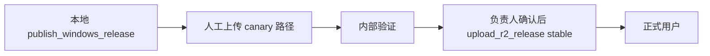

# Canary 预发布通道设计

> 用途：在将版本提升到 **stable**（正式用户通道）之前，通过独立的 canary R2 路径做内部安装与预发布验证，降低 feed 或 alias 误发布对全量用户的影响。  
> **本文档不含任何 R2 凭证**；环境变量名与 [PACKAGING_WINDOWS.md](PACKAGING_WINDOWS.md) 一致，值仅从本机 secret / CI 注入。

## 边界

- **默认用户始终使用 stable**：客户端 `app/velopack_config.py` 中 `UPDATE_FEED_URL` 固定为 `https://updates.qiaoqiao.buzz/releases/win/stable`，本设计**不修改**该默认值。
- **canary**：仅内部 / 测试安装验证；错误发布不影响已发布的正式安装版用户。
- **stable**：面向所有正式用户的主更新源与主下载入口（行为与现行 `upload_r2_release.ps1` 一致）。
- **canary → stable 提升**：必须经过负责人人工确认；不得在未完成 canary 验证的情况下直接切换 stable feed。
- 本设计**不实现**客户端灰度百分比、UI 通道切换、Supabase `release_url` 改指向 canary。
- GitHub Releases 仍为 stable 镜像；**不设**独立 canary GitHub tag（非目标）。

## 发布流程概览

```text
本地 publish_windows_release.ps1
    → 人工上传 canary R2 路径（本文 §3）
    → 内部 canary 验证（本文 §4）
    → 负责人签字确认（本文 §5）
    → upload_r2_release.ps1（现有 stable 脚本，不改）
    → RELEASE_ONLINE_VERIFY_AND_ROLLBACK 只读验证 stable
```



## R2 对象路径（与 stable 平行）

将 `<version>` 替换为语义版本号（如 `0.3.8`）。

| 类型 | Stable（现行） | Canary（建议） | 公开 URL |
|------|----------------|----------------|----------|
| 更新 feed | `releases/win/stable/releases.win.json` | `releases/win/canary/releases.win.json` | `https://updates.qiaoqiao.buzz/releases/win/canary` |
| Full nupkg | `releases/win/stable/PEPETII.DanmuAI-<version>-full.nupkg` | `releases/win/canary/PEPETII.DanmuAI-<version>-full.nupkg` | — |
| Delta nupkg（若有） | `releases/win/stable/PEPETII.DanmuAI-<version>-delta.nupkg` | `releases/win/canary/PEPETII.DanmuAI-<version>-delta.nupkg` | — |
| 版本化 Setup | `downloads/PEPETII.DanmuAI-<version>-Setup.exe` | `downloads/canary/PEPETII.DanmuAI-<version>-Setup.exe` | — |
| 版本化 Portable | `downloads/PEPETII.DanmuAI-<version>-win-Portable.zip` | `downloads/canary/PEPETII.DanmuAI-<version>-win-Portable.zip` | — |
| Setup latest alias | `downloads/DanmuAI-Setup.exe` | `downloads/canary/DanmuAI-Setup.exe` | `https://updates.qiaoqiao.buzz/downloads/canary/DanmuAI-Setup.exe` |
| Portable latest alias | `downloads/PEPETII.DanmuAI-win-Portable.zip` | `downloads/canary/PEPETII.DanmuAI-win-Portable.zip` | `https://updates.qiaoqiao.buzz/downloads/canary/PEPETII.DanmuAI-win-Portable.zip` |

**路径隔离原则：**

- canary 与 stable **不共用**版本化 Setup / Portable 对象键（避免 server-side copy 时误写到 stable alias）。
- 上传顺序与 `upload_r2_release.ps1` 一致：**nupkg → 版本化 Setup/Portable → feed → alias**（feed 必须在 alias 切换前到位）。
- 上传前复用 `SHA256SUMS.txt`（`write_release_hash_manifest.ps1 -VerifyOnly`）作为本地完整性门禁。

## Canary 发布步骤（文档化；执行前须负责人确认）

> **危险边界**：下列凡涉及 `aws s3 cp`（含 server-side copy）的操作，**执行前必须由发布负责人书面确认**。本工单不提供自动 canary 上传脚本（见 §6 后续工单建议）。

### 前置：本地构建与门禁

```powershell
Set-Location "E:\path\to\danmu"
.\scripts\publish_windows_release.ps1
.\scripts\verify_windows_release_artifacts.ps1
.\scripts\write_release_hash_manifest.ps1 -ReleaseDir release\velopack -VerifyOnly
```

确认 `release\velopack\` 含目标版本的 Setup、full.nupkg、releases.win.json；若有 delta 则 feed 中须含 `Type: Delta`。

### 环境准备

```powershell
$Endpoint = "https://$($env:R2_ACCOUNT_ID).r2.cloudflarestorage.com"
$Bucket = $env:R2_BUCKET
$ReleaseDir = "release\velopack"
$TargetVersion = "0.3.8"   # 替换为本次版本
```

### 步骤 1：上传 nupkg 与版本化下载对象

```powershell
# ⚠️ 危险 — 执行前必须由负责人确认
$nupkg = Join-Path $ReleaseDir "PEPETII.DanmuAI-$TargetVersion-full.nupkg"
aws s3 cp $nupkg "s3://$Bucket/releases/win/canary/PEPETII.DanmuAI-$TargetVersion-full.nupkg" `
    --endpoint-url $Endpoint --cache-control "public, max-age=3600" --only-show-errors

$delta = Join-Path $ReleaseDir "PEPETII.DanmuAI-$TargetVersion-delta.nupkg"
if (Test-Path -LiteralPath $delta) {
    aws s3 cp $delta "s3://$Bucket/releases/win/canary/PEPETII.DanmuAI-$TargetVersion-delta.nupkg" `
        --endpoint-url $Endpoint --cache-control "public, max-age=3600" --only-show-errors
}

$setup = Join-Path $ReleaseDir "PEPETII.DanmuAI-$TargetVersion-Setup.exe"
aws s3 cp $setup "s3://$Bucket/downloads/canary/PEPETII.DanmuAI-$TargetVersion-Setup.exe" `
    --endpoint-url $Endpoint --cache-control "public, max-age=86400" --only-show-errors

$portable = Join-Path $ReleaseDir "PEPETII.DanmuAI-win-Portable.zip"
if (Test-Path -LiteralPath $portable) {
    aws s3 cp $portable "s3://$Bucket/downloads/canary/PEPETII.DanmuAI-$TargetVersion-win-Portable.zip" `
        --endpoint-url $Endpoint --cache-control "public, max-age=86400" --only-show-errors
}
```

### 步骤 2：上传 feed（必须在 alias 之前）

```powershell
# ⚠️ 危险 — 执行前必须由负责人确认
$feed = Join-Path $ReleaseDir "releases.win.json"
aws s3 cp $feed "s3://$Bucket/releases/win/canary/releases.win.json" `
    --endpoint-url $Endpoint --cache-control "public, max-age=60" --only-show-errors
```

### 步骤 3：切换 canary latest alias（server-side copy）

```powershell
# ⚠️ 危险 — 执行前必须由负责人确认
aws s3 cp "s3://$Bucket/downloads/canary/PEPETII.DanmuAI-$TargetVersion-Setup.exe" `
    "s3://$Bucket/downloads/canary/DanmuAI-Setup.exe" `
    --endpoint-url $Endpoint --cache-control "no-cache" --metadata-directive REPLACE --only-show-errors

aws s3 cp "s3://$Bucket/downloads/canary/PEPETII.DanmuAI-$TargetVersion-win-Portable.zip" `
    "s3://$Bucket/downloads/canary/PEPETII.DanmuAI-win-Portable.zip" `
    --endpoint-url $Endpoint --cache-control "no-cache" --metadata-directive REPLACE --only-show-errors
```

### Delta bootstrap（可选）

若下一版 canary 需要基于 canary 历史生成 delta，可在本地 pack 前 bootstrap：

```powershell
vpk download http --url https://updates.qiaoqiao.buzz/releases/win/canary --outputDir release\velopack
```

当前 `publish_windows_release.ps1` 默认 bootstrap stable feed；改指向 canary 需另开工单（见 §6 `W-REL-CANARY-PACK-001`）。

## Canary 验证清单

canary 上传完成后，由测试人员逐项验证。**全部通过**后方可进入 stable 提升流程。

### 1. 新鲜安装（canary Setup alias）

1. 在测试机下载：`https://updates.qiaoqiao.buzz/downloads/canary/DanmuAI-Setup.exe`
2. 运行安装器，确认应用可启动、Web 控制台可打开、Overlay 正常
3. 核对版本号与 `$TargetVersion` 一致

### 2. 安装版检查更新、下载与重启安装

| 场景 | 方法 | 说明 |
|------|------|------|
| **stock 安装包（现行）** | 托盘 / Web「检查更新」 | **无法验证 canary feed 内更新**：`app/update_service.py` 经 `UpdateManager(UPDATE_FEED_URL)` 固定查询 **stable** feed，与 canary 路径无关 |
| **内部 build（后续工单）** | 设置 `DANMU_UPDATE_FEED_URL=https://updates.qiaoqiao.buzz/releases/win/canary` 后安装旧版 canary、上传新版 canary feed，再检查更新 | 见 §6 `W-REL-CANARY-CLIENT-001` |

**现行可验证的子集：**

- 从 canary 新鲜安装后，确认应用**不会**因 stable 上有更新而误提示降级到错误版本（若 stable 版本较低或无更新，行为应正常）
- 若 stable 已发布更高版本，stock canary 安装可能提示更新到 stable——属预期（客户端硬编码 stable）；**不得**将此当作 canary 验证通过

完整「canary 旧版 → canary 新版」应用内更新循环，须待 `W-REL-CANARY-CLIENT-001` 落地后再纳入门禁。

### 3. `%APPDATA%/DanmuAI/` 数据保留

在测试机上：

1. 安装 canary 版并写入配置（如修改一项 Web 设置）
2. 记录 `%APPDATA%/DanmuAI/config.db` 与 `%APPDATA%/DanmuAI/.key` 的 SHA256
3. 卸载（托盘选择「保留数据」）或覆盖安装新版 canary
4. 确认 `config.db` / `.key` SHA256 不变；`startup.log` 保留

证据模板见 `reports/W-REL-SETUP-004-setup-smoke-report.md`。

### 4. stable 通道不受影响

canary 上传前后，对 **stable** 执行 [RELEASE_ONLINE_VERIFY_AND_ROLLBACK.md](RELEASE_ONLINE_VERIFY_AND_ROLLBACK.md) 只读验证：

- feed latest Full 版本应与 canary 操作前 baseline **一致**（除非同期有 intentional stable 发布）
- `downloads/DanmuAI-Setup.exe` 与 `downloads/PEPETII.DanmuAI-win-Portable.zip` alias 大小不变
- 正式用户下载入口与 Velopack 自动更新源未被 canary 操作污染

### 5. Canary 只读验证（HTTP）

```powershell
$TargetVersion = "0.3.8"
$FeedUrl = "https://updates.qiaoqiao.buzz/releases/win/canary"
$feed = Invoke-RestMethod -Uri $FeedUrl
$latestFull = ($feed.Assets | Where-Object { $_.Type -eq "Full" } |
    ForEach-Object { [version]$_.Version } |
    Sort-Object -Descending | Select-Object -First 1).ToString()
if ($latestFull -ne $TargetVersion) {
    throw "Canary feed latest Full is $latestFull, expected $TargetVersion"
}
Write-Host "OK: canary feed latest Full = $TargetVersion"

$SetupAliasUrl = "https://updates.qiaoqiao.buzz/downloads/canary/DanmuAI-Setup.exe"
$r = Invoke-WebRequest -Uri $SetupAliasUrl -Method Head -UseBasicParsing
Write-Host "Canary Setup alias: $($r.StatusCode), Content-Length: $($r.Headers['Content-Length'])"
```

## 提升 stable 条件与流程

### 人工门禁 checklist

全部勾选后，方可运行 `upload_r2_release.ps1`：

- [ ] Canary feed HTTP 可访问，latest Full = 目标版本
- [ ] Canary Setup alias 可下载，SHA256 与本地 `SHA256SUMS.txt` 一致
- [ ] 新鲜安装 smoke 通过（启动、Web、Overlay）
- [ ] 数据保留验证通过（或标注 N/A：全新测试机）
- [ ] Stable 只读验证 baseline 已记录且 canary 操作后未意外改变
- [ ] **负责人书面确认**（见下方模板）

### 签字模板

```text
Canary 版本：________
验证日期：________
验证人：________
负责人确认提升 stable：是 / 否
备注：
```

### 提升动作

1. 使用现有脚本上传 stable（**不改** `upload_r2_release.ps1` 默认行为）：

   ```powershell
   .\scripts\upload_r2_release.ps1 -Version <TargetVersion>
   ```

2. 按 [RELEASE_ONLINE_VERIFY_AND_ROLLBACK.md](RELEASE_ONLINE_VERIFY_AND_ROLLBACK.md) 验证 stable 四状态（本地 / feed / Setup alias / Portable alias）。

3. （可选）同步 GitHub Releases 镜像：`.\scripts\upload_github_release.ps1`

4. Canary 路径可保留同版本供下一轮预发布；**不得**假设 canary 与 stable 自动同步。

## 后续代码工单建议

本工单仅定义文档与配置边界；以下能力需**另开工单**：

| 建议 ID | 标题 | 范围 | 非目标 |
|---------|------|------|--------|
| W-REL-CANARY-UPLOAD-001 | `upload_r2_release.ps1 -Channel Canary` | 参数化 R2 键前缀；默认仍为 stable | 不改默认上传目标 |
| W-REL-CANARY-CLIENT-001 | 内部 feed 覆盖 `DANMU_UPDATE_FEED_URL` | `velopack_config.py` + `update_service.py`；仅 frozen 且 env 存在时生效 | UI 通道切换、灰度百分比 |
| W-REL-CANARY-PACK-001 | `publish_windows_release.ps1` 支持 canary bootstrap feed | `-BootstrapFeedUrl` 指向 canary，便于 canary delta 链 | 不改 stable 默认 bootstrap |

## 非目标（明确排除）

- 客户端灰度百分比
- 修改 stable feed 或 stable alias 的默认上传逻辑
- 实际上传 canary 产物（本设计文档工单不执行线上写操作）
- 修改 Supabase `app_updates.release_url` 指向 canary
- Web 设置页新增通道切换 UI
- GitHub Releases 独立 canary tag

## 相关文档

- [PACKAGING_WINDOWS.md](PACKAGING_WINDOWS.md) — 打包与 stable 上传
- [RELEASE_ONLINE_VERIFY_AND_ROLLBACK.md](RELEASE_ONLINE_VERIFY_AND_ROLLBACK.md) — stable 只读验证与回滚
- [IDE_WINDOWS_BUILD_PLAYBOOK.md](IDE_WINDOWS_BUILD_PLAYBOOK.md) — 本地构建手册
- [.agents/skills/danmu-windows-release-upload/references/release-flow.md](../../.agents/skills/danmu-windows-release-upload/references/release-flow.md) — 发布链与用户可见行为
- `app/velopack_config.py` — 生产默认 `UPDATE_FEED_URL`（stable）
