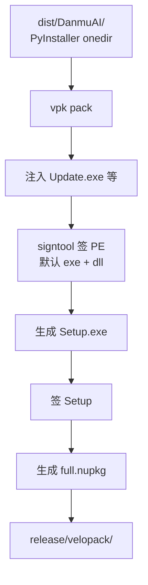
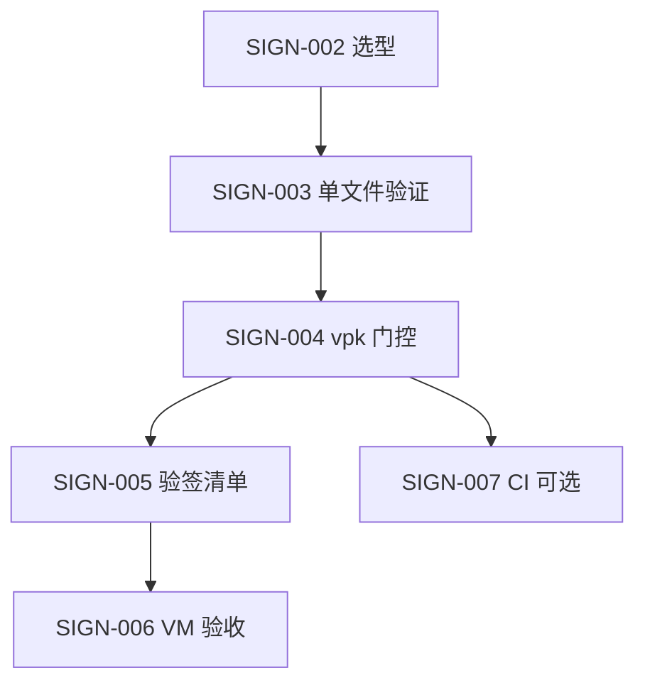

# Windows 代码签名与 SmartScreen 优化评估

> 工单：W-REL-R2V-SIGN-001 独立评估。基于 v0.3.0 已冻结发布链路（PyInstaller onedir → Velopack → Cloudflare R2 → GitHub Releases 镜像）。**本报告仅评估与方案设计，未采购证书、未执行发布脚本、未上传 R2/GitHub。**

评估日期：2026-06-11

---

## 1. 当前状态

### 1.1 冻结发布链路

```text
build_exe.ps1 (PyInstaller onedir)
  → publish_windows_release.ps1
    → velopack_pack.ps1 (vpk pack)
  → upload_r2_release.ps1 (主真源)
  → upload_github_release.ps1 (镜像)
```

| 脚本 | 签名相关事实 |
|------|-------------|
| `scripts/build_exe.ps1` | 仅调用 PyInstaller；**无** Windows Authenticode 步骤 |
| `DanmuAI.spec` | `codesign_identity=None`（PyInstaller 该字段为 **macOS only**，对 Windows 无效） |
| `scripts/velopack_pack.ps1` | `vpk pack` **未**传入 `--signParams` / `--azureTrustedSignFile` |
| `scripts/publish_windows_release.ps1` | 串联 build + vpk；**无**验签或签名钩子 |
| `scripts/upload_r2_release.ps1` | 上传 Setup、nupkg、feed；**无**签名门禁 |

### 1.2 v0.3.0 已验收项（与签名无关）

- R2 主更新源公网可访问；GitHub Releases v0.3.0 镜像已上传
- 安装 / 卸载 / 重装 / 旧版升级通过
- `%APPDATA%\DanmuAI\` 数据保护通过（`config.db`、`.key`、`startup.log`）
- README 已说明 SmartScreen 风险（[README.md](../README.md) L85）

### 1.3 现有文档占位

- [docs/operations/WINDOWS_CODE_SIGNING.md](../docs/operations/WINDOWS_CODE_SIGNING.md) — 声明签名不阻塞主链
- [docs/operations/WINDOWS_RELEASE_CONTRACT.md](../docs/operations/WINDOWS_RELEASE_CONTRACT.md) §5 — 无代码签名边界
- 草案脚本（未接入主链）：`scripts/sign_windows_release.ps1`（默认 `DANMU_CODE_SIGN` 未设置则退出）

---

## 2. 当前风险

| 风险 | 影响 | 与下载源关系 |
|------|------|-------------|
| SmartScreen「未知发布者」 | 首装 `DanmuAI-Setup.exe` 可能被拦截或需额外点击 | **无关**（R2 / GitHub 均可能触发） |
| 企业组策略 | 未签名 exe 可能被 IT 策略禁止执行 | 无关 |
| Defender 启发式 | 未签名新发布者二进制更易被标为可疑（误报概率高于已签名） | 无关 |
| 应用内更新 | `*-full.nupkg` 内未签名 PE 在更新后仍可能单独触发警告 | 与首装 Setup 是否签名一致有关 |
| 用户信任与转化 | 普通用户可能因安全提示放弃安装 | 产品层面 |

**用户典型操作**：SmartScreen 对话框 →「更多信息」→「仍要运行」。README 已按此编写，**表述准确**。

**技术层面**：未签名**不**影响 Velopack 更新机制、不破坏 `%APPDATA%\DanmuAI\` 数据、不引入 R2 凭证泄露（客户端仅 HTTPS 读公开 URL）。

---

## 3. 是否阻塞 v0.3.0 发布

**结论：不阻塞。**

| 依据 | 说明 |
|------|------|
| v0.3.0 已发布 | 安装/更新/数据保护验收已通过（见 [windows-release-final-check.md](windows-release-final-check.md)） |
| 发布契约 | [WINDOWS_RELEASE_CONTRACT.md](../docs/operations/WINDOWS_RELEASE_CONTRACT.md) §5 明确「当前无代码签名预算；主链实施**不阻塞**于证书采购」 |
| 产品策略 | 可先保留未签名发布，在 README 中披露风险；后续版本单独接入签名 |

**是否必须立刻签名才能继续发布？→ 否。** 后续增量版本在未签名状态下仍可发布，但应维持 SmartScreen 用户说明。

---

## 4. 证书类型对比

依据 [Velopack Code Signing 文档](https://docs.velopack.io/packaging/signing) 与 Microsoft SmartScreen 声誉机制：

| 类型 | SmartScreen 行为 | 成本 / 门槛 | CI 自动化 | DanmuAI 适用性 |
|------|-----------------|-------------|-----------|----------------|
| **未签名** | 每个新文件需单独积累声誉；持续「未知发布者」 | 无 | — | **当前现状** |
| **OV 标准代码签名** | 按**证书**积累声誉；同证后续版本警告减少；**续证 / 换证后可能再警告** | 中（约数百美元/年）；2023 年起多为 USB HSM 或授权云 HSM，**PFX 导出受限** | USB HSM 需人工 PIN，CI 难 | 可行，体验一般 |
| **EV 扩展验证** | **即时 SmartScreen 声誉**（官方称基本无警告） | 高（严格身份核验 + 硬件令牌，年费通常高于 OV） | 同 OV，自动化困难 | 预算充足时的传统最优 |
| **Azure Artifact Signing**（原 Trusted Signing） | **即时声誉**（类 EV） | 约 USD $10/月；需 Azure 订阅 + 身份验证 | **`az login` / OIDC**，最适合 CI | **个人开发者长期首选候选** |

### 4.1 普通 OV 能否立刻消除 SmartScreen？

**不能。** OV 证书首版及换证后通常仍有短期警告，需靠下载量与用户执行积累证书声誉。

### 4.2 EV 是否更适合？

**从 SmartScreen 体验看，EV（及 Azure Artifact Signing）明显优于 OV。** 但 EV 成本高、身份核验严、硬件令牌限制使个人开发者 CI 集成困难。对个人项目，**Azure Artifact Signing** 在成本与自动化之间更平衡。

---

## 5. 当前发布链路签名点分析

### 5.1 Velopack 要求在 pack 阶段签名

Velopack 官方说明：**签名必须由 Velopack 在打包过程中完成**，因为 `Update.exe`、`Setup.exe` 及 nupkg 内容在不同阶段生成，需在 `vpk pack` 流程内增量签名。



### 5.2 策略对比

| 策略 | 评估 |
|------|------|
| PyInstaller 后、vpk 前签 `dist/DanmuAI/` | **不充分**：Velopack 仍注入未签名的 `Update.exe`；repack 可能覆盖 |
| **`vpk pack --signParams` / `--azureTrustedSignFile`** | **推荐**：默认签全部 PE（exe/dll），含包内二进制与 Setup |
| 仅事后签 `*-Setup.exe` | **不足**：nupkg 内 `DanmuAI.exe` / DLL 仍无签名，应用内更新仍会警告 |

### 5.3 应签哪些文件

| 产物 | 必须签 | 说明 |
|------|--------|------|
| `DanmuAI.exe` | 是 | 主程序；进入 nupkg |
| `_internal/*.dll`、`.pyd`、`python*.dll`、Qt/WebView 等 | 是（Velopack 默认） | 可用 `--signExclude` 跳过 DLL，**不推荐** |
| Velopack `Update.exe` | 是 | 仅 pack 阶段生成，无法事先签名 |
| `PEPETII.DanmuAI-win-Setup.exe` / 版本化 Setup | 是 | R2 `downloads/DanmuAI-Setup.exe` 同源 |
| `*-full.nupkg` 内 PE | 是 | 应用内更新拉取；须与首装签名身份一致 |
| `*-Portable.zip` | 次要 | GitHub 镜像附件；若对外分发建议同策略 |
| json / 静态资源 | 否 | 非 PE，无需 Authenticode |

### 5.4 打包前签还是打包后签？

**在 `vpk pack` 过程中签（打包时签），而非打包前单独签 dist、也非仅打包后签 Setup。**

推荐接入点：`scripts/velopack_pack.ps1` 内 `vpk pack` 调用，由环境变量 `DANMU_CODE_SIGN=1` 门控（**当前默认关闭**，不改变现有发布行为）。

`publish_windows_release.ps1` 可在证书就绪后增加**可选**发布后验签（`signtool verify`），但不应替代 vpk 内签名。

---

## 6. 推荐短期方案

**适用：当前 ~ 下一正式版（个人开发者、无签名预算）**

1. **继续未签名发布**，保持 Velopack + R2 冻结主链不变。
2. **维持 README SmartScreen 说明**（「更多信息 → 仍要运行」），不夸大签名状态。
3. **不在 `publish_windows_release.ps1` 默认路径接入签名**；维护者发布流程不变。
4. **可选本机试点**（不上传、不改 CI）：
   - 单独对 `dist/DanmuAI/DanmuAI.exe` 跑 `signtool sign` 验证证书可用；
   - 再对 POC 目录跑 `vpk pack ... --signParams`（参数经环境变量注入）。
5. **评估 Azure Artifact Signing** 作为下一预算项（约 $10/月，CI 友好，即时声誉）。

**是否适合先保留未签名、后续单独接入？→ 适合。** 与当前契约及 v0.3.0 实践一致。

---

## 7. 推荐长期方案

**适用：证书到位后的正式版本**

1. **证书选型**：优先 **Azure Artifact Signing**；其次传统 **OV**；预算充足且需传统 CA 时选 **EV**。
2. **在 `velopack_pack.ps1` 启用签名门控**：`DANMU_CODE_SIGN=1` 时向 `vpk pack` 传入 `--signParams` 或 `--azureTrustedSignFile`。
3. **发布后验签**：对 `PEPETII.DanmuAI-*-Setup.exe` 执行 `signtool verify /pa /v`；抽样验证 nupkg 内主 exe。
4. **更新 RELEASE_CHECKLIST**：签名有效、RFC 3161 时间戳、VM SmartScreen 实测。
5. **干净 VM 验收**：Win10/11 全新环境首装 + 就地升级（0.x → 0.y），记录 SmartScreen 是否仍出现。
6. **可选第二阶段门禁**：`upload_r2_release.ps1` 在 `DANMU_REQUIRE_SIGNED=1` 时拒绝未签名 Setup（证书稳定后再启用）。

---

## 8. 脚本接入预案

### 8.1 当前主链（不变）

```powershell
.\scripts\publish_windows_release.ps1    # 默认无签名
.\scripts\upload_r2_release.ps1
.\scripts\upload_github_release.ps1
```

### 8.2 草案脚本（默认不执行）

`scripts/sign_windows_release.ps1`：

- `DANMU_CODE_SIGN` 未设为 `1` 时立即退出（exit 0），**不影响**现有发布。
- 证书参数仅经环境变量 / Windows 证书存储读取；**无**硬编码 PFX 路径或密码。
- 支持验签模式：对 `release/velopack/*-Setup.exe` 执行 `signtool verify`。

### 8.3 `velopack_pack.ps1` 未来改动（SIGN-004 工单）

```powershell
# 仅当 DANMU_CODE_SIGN=1 时追加（示意，尚未接入主链默认路径）
$signArgs = @()
if ($env:DANMU_CODE_SIGN -eq "1") {
    if ($env:VPK_AZURE_TRUSTED_SIGN_FILE) {
        $signArgs = @("--azureTrustedSignFile", $env:VPK_AZURE_TRUSTED_SIGN_FILE)
    } elseif ($env:VPK_SIGN_PARAMS) {
        $signArgs = @("--signParams", $env:VPK_SIGN_PARAMS)
    } else {
        Write-Error "DANMU_CODE_SIGN=1 but neither VPK_SIGN_PARAMS nor VPK_AZURE_TRUSTED_SIGN_FILE is set"
    }
}
& vpk pack ... @signArgs
```

Velopack 亦支持将 CLI 选项映射为 `VPK_*` 环境变量（见 [Packaging Overview](https://docs.velopack.io/packaging/overview)），CI 中优先用 secret 注入。

### 8.4 环境变量（禁止入库）

| 变量 | 用途 |
|------|------|
| `DANMU_CODE_SIGN` | `1` = 启用签名；默认未设置 = 关闭 |
| `VPK_SIGN_PARAMS` | 传给 `vpk pack --signParams`（signtool 参数，不含 `sign` 子命令） |
| `VPK_AZURE_TRUSTED_SIGN_FILE` | Azure Artifact Signing 元数据 JSON **路径**（文件本身不入库） |
| `DANMU_REQUIRE_SIGNED` | 未来上传门禁（可选，默认关闭） |
| `AZURE_*` / `az login` | ATS 认证（维护者本机或 CI OIDC） |

**signtool 参数示例结构**（占位，勿复制真实路径/密码）：

```text
/fd sha256 /td sha256 /tr http://timestamp.digicert.com /a
```

证书在 Windows 存储时使用 `/n "Publisher Display Name"` 替代 `/f`；密码通过 `%ENV_VAR%` 引用，勿写入脚本或日志。

### 8.5 是否需在 `publish_windows_release.ps1` 预留步骤？

**短期：不需要改动默认脚本。** 验签可在证书就绪后由 `sign_windows_release.ps1 -VerifyOnly` 或 SIGN-005 工单单独接入。

**长期：可选**在 `publish_windows_release.ps1` 末尾调用验签（仍由 `DANMU_CODE_SIGN=1` 门控），**不**在默认路径强制签名。

---

## 9. 密钥与证书安全边界

### 9.1 绝对不能入库

- PFX / P12 文件、证书私钥、`.key`
- 证书密码、USB Token PIN、ATS 账户密钥
- Base64 编码的证书 blob
- 含真实 Endpoint / AccountName 的 `metadata.json`（若含敏感配置）
- CI 日志中完整的 `signtool /debug` 输出（可能泄露路径与参数）

### 9.2 推荐做法

| 场景 | 做法 |
|------|------|
| 传统 OV/EV + USB HSM | 证书存硬件令牌；PIN 仅发布时人工输入；**不进 CI** |
| PFX（若 CA 仍提供） | 存维护者本机受控目录；密码仅环境变量；**永不提交 Git** |
| Windows 证书存储 | `signtool /n "Publisher Name"`；避免 `/f` + `/p` 出现在命令行历史 |
| Azure Artifact Signing | `az login` 或 GitHub Actions OIDC；元数据 JSON 路径经 env 传入 |
| CI | 使用 GitHub `secrets.*`；Velopack `VPK_*` env；专用受信 Windows runner |

### 9.3 CI / 本地发布风险

| 风险 | 缓解 |
|------|------|
| 日志泄露 `/p` 密码 | 密码放 env；`VPK_SIGN_PARAMS` 用 `%VAR%` 展开 |
| 共享 runner 上证书残留 | 专用 self-hosted 或单次 import + 构建后删除 keychain |
| signtool 加载错误 .NET（Velopack #142） | 签名参数使用**绝对路径**；CI 优先 Windows SDK 自带 signtool |
| 误将 PFX 加入 Release 附件 | RELEASE_CHECKLIST 增加「产物中无证书文件」检查 |

---

## 10. 后续实施工单拆分

| 工单 ID | 内容 | 依赖 |
|---------|------|------|
| **SIGN-002** | 证书选型与经济评估（ATS vs OV vs EV）；开通 Azure 或采购 CA | 预算决策 |
| **SIGN-003** | 本机对 `dist/DanmuAI/DanmuAI.exe` 单独 `signtool sign` 验证 | SIGN-002 |
| **SIGN-004** | `velopack_pack.ps1` 增加 `DANMU_CODE_SIGN` 门控；完善 `sign_windows_release.ps1` | SIGN-003 |
| **SIGN-005** | 发布后 `signtool verify`；更新 RELEASE_CHECKLIST / WINDOWS_CODE_SIGNING | SIGN-004 |
| **SIGN-006** | 干净 VM：首装 + 应用内更新 SmartScreen 实测 | SIGN-005 |
| **SIGN-007**（可选） | GitHub Actions Windows runner + OIDC/secret 自动签名 | SIGN-004 |



---

## 附录 A：十项必答结论速查

| # | 问题 | 结论 |
|---|------|------|
| 1 | 是否必须立刻签名才能继续发布？ | **否** |
| 2 | 不签名用户风险？ | SmartScreen / 企业策略拦截；需「更多信息 → 仍要运行」 |
| 3 | 普通 OV 能否立刻消除 SmartScreen？ | **不能** |
| 4 | EV 是否更适合？成本门槛？ | SmartScreen 体验最佳；成本高、硬件令牌、CI 难 |
| 5 | 个人开发者短期方案？ | 未签名发布 + README 说明；试点 ATS |
| 6 | 长期方案？ | `vpk pack` 签名 + 验签 + VM 验收 |
| 7 | 签名接在哪个阶段？ | **`velopack_pack.ps1` / `vpk pack` 过程中** |
| 8 | 环境变量？ | `DANMU_CODE_SIGN`、`VPK_SIGN_PARAMS`、`VPK_AZURE_TRUSTED_SIGN_FILE` 等 |
| 9 | 绝对不能入库？ | PFX、密码、PIN、密钥、含 secret 的 metadata |
| 10 | 后续拆单？ | SIGN-002 ~ SIGN-007（见 §10） |

---

## 附录 B：验收自检（本工单）

- [x] 未改动 `publish_windows_release.ps1` / `upload_r2_release.ps1` 默认行为
- [x] 未执行 publish / upload / 未创建 GitHub Release
- [x] 无 PFX、密码、PIN、真实密钥入仓
- [x] 本报告含 10 节 + 十项明确结论
- [x] README SmartScreen 说明未修改（仍准确）
- [x] Velopack + R2 发布链路文档仍标为冻结
